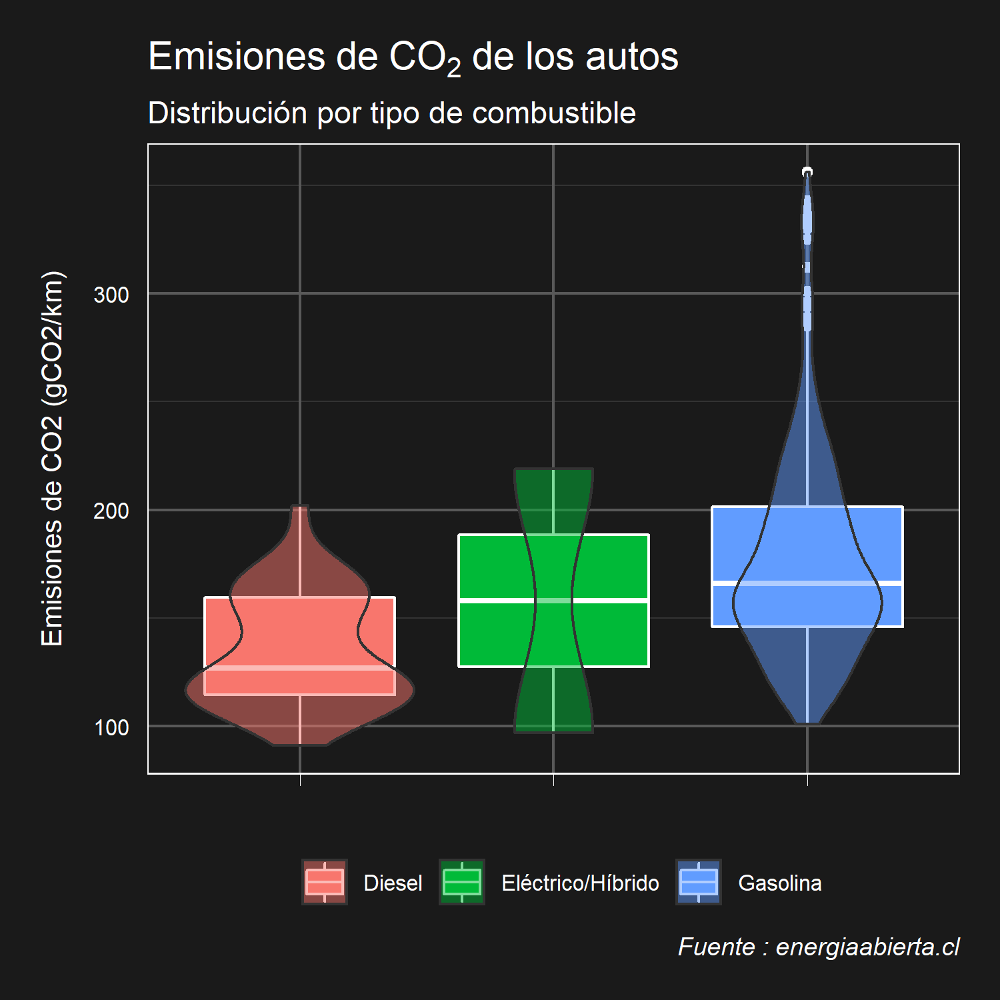
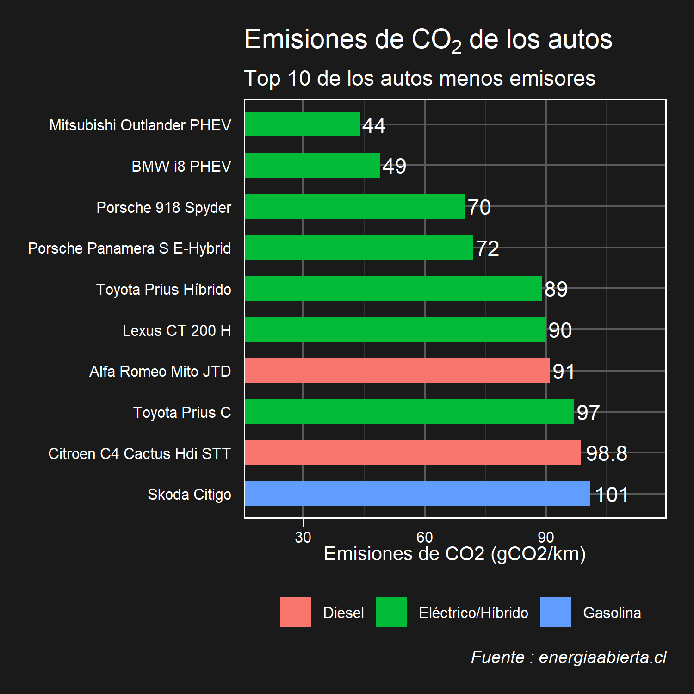
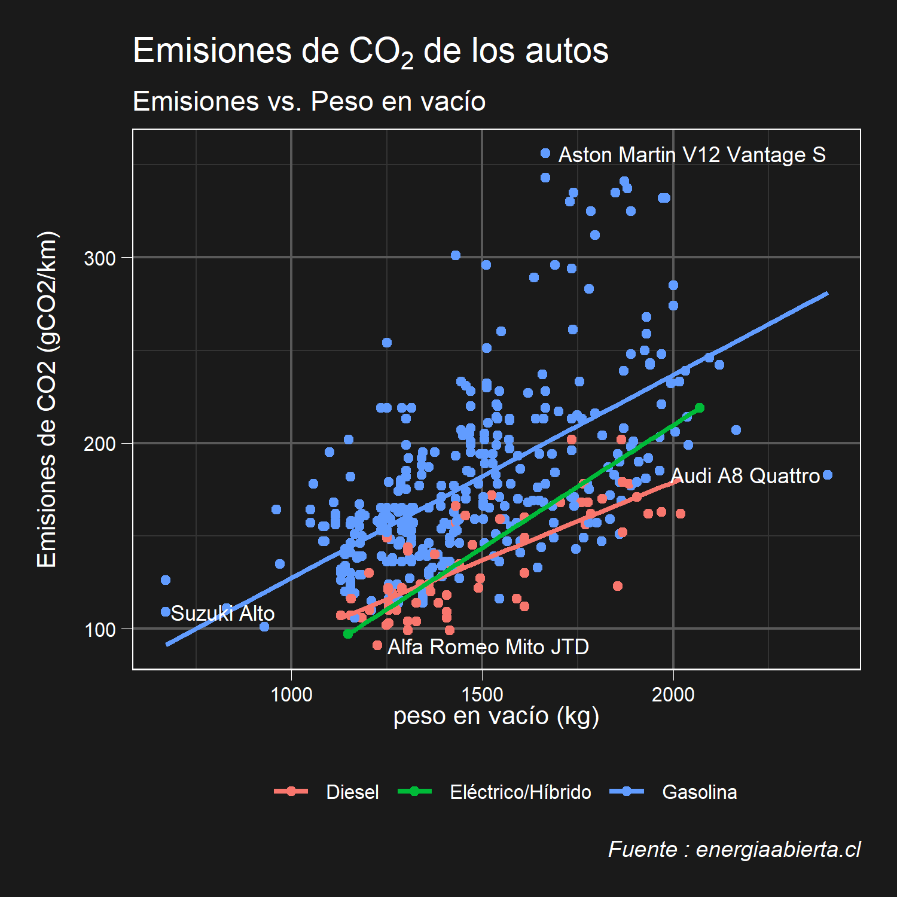
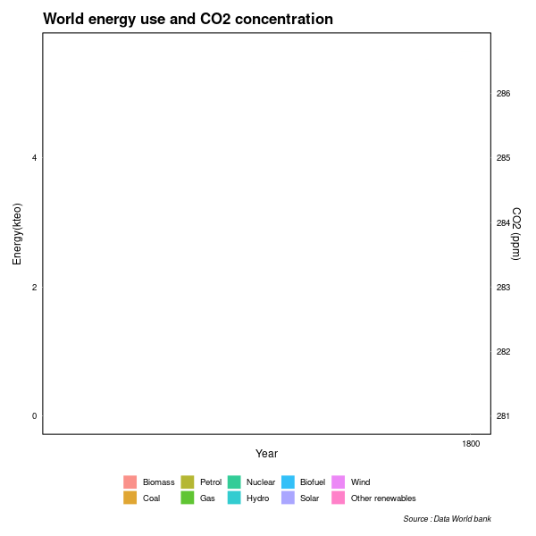
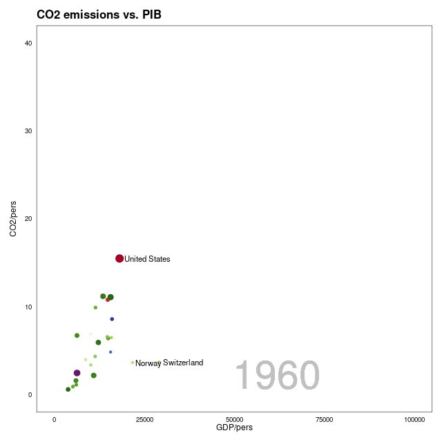
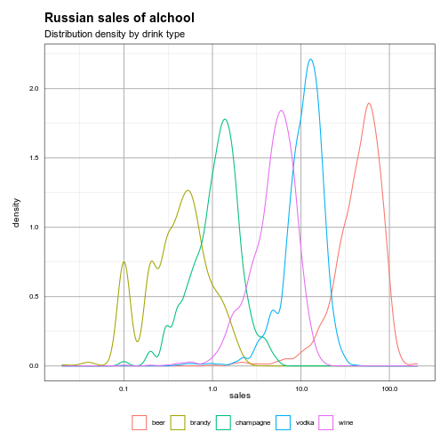
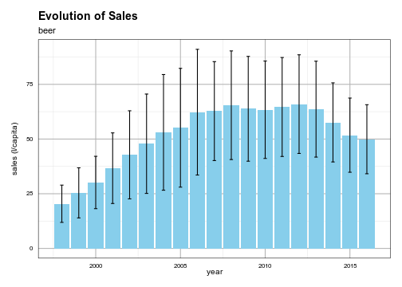

# Data science projects

## Data visualization

### [CO2 emissions](https://rpubs.com/fabrouault/carsco2)
For a post in instagram in partnership with the team of @yachay_data, I made some figures about Co2 emission from passenger cars in relation to the fuel type and the weight. Data from homologated car by the Chilean department of transportation and the weight was web scraped from carfolio webpage using Rvest package ([view web scraping code](https://rpubs.com/fabrouault/webscrapcars))

  

### [Global CO2 emissions](https://rpubs.com/fabrouault/Co2animate)
For an introduction of a course about carbon footprint in Buildings, I made two animation that show the relationship between CO2 concentration, Energy, GDP

  

### [Datacamp competition - Drinks promotions](https://app.datacamp.com/workspace/w/fa9bab3b-d1a0-46af-bf56-2f98dca60c53)
  

## Machine learning

### [Cluster analysis of show appartment in Santiago de Chile using k-means method](https://rpubs.com/fabrouault/deptosSantiago)

